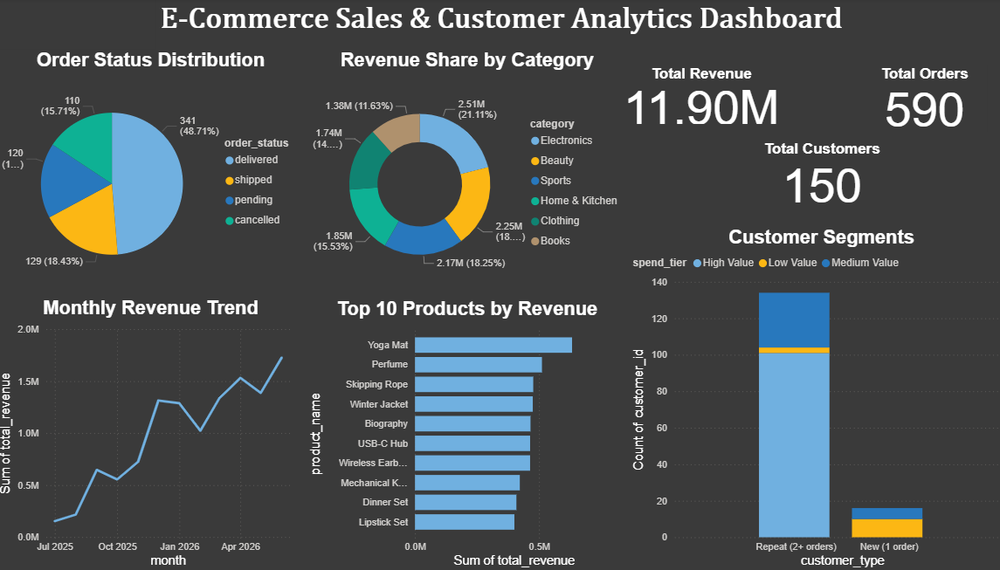

# Sales & Retail Analytics Dashboard

An end-to-end analytics pipeline: PostgreSQL → SQL KPI views → Power BI dashboard, built on top of an existing e-commerce order management database.

## Overview
This project demonstrates the full analytics workflow — from raw transactional data in PostgreSQL, through SQL-based KPI extraction using views, to an interactive Power BI dashboard.

## Tech Stack
- PostgreSQL (data storage, SQL views)
- Python (psycopg2, Faker) — data seeding
- Power BI Desktop — dashboard & visualization

## Project Structure
sales_analytics_dashboard/
├── db_config.py          # Reusable DB connection helper
├── seed_data.py           # Generates realistic seed data (customers, products, orders)
├── kpi_queries.sql        # Standalone KPI queries (for reference/testing)
├── create_views.sql       # SQL views consumed by Power BI
├── sales_dashboard.pbix   # Power BI dashboard file
├── .env                   # DB credentials (not committed)
└── .gitignore

## KPIs Covered
1. **Monthly Revenue Trends** — revenue, order count, and average order value over time
2. **Top Products** — best sellers by revenue and units sold
3. **Category Performance** — revenue share and order volume by category
4. **Customer Segmentation** — new vs. repeat customers, spend tiers (High/Medium/Low value)
5. **Order Status Breakdown** — order distribution and revenue impact by status

## Key Insights from the Data
- Revenue grew steadily from ~₹1.5L (Jul 2025) to ~₹17L (Jun 2026)
- Repeat, high-value customers (101 of 150) drive over 85% of total revenue
- ~15.7% of orders are cancelled, representing ~₹22.7L in lost potential revenue
- Electronics leads category revenue share (21.1%), followed by Beauty (18.9%) and Sports (18.3%)

## How to Reproduce
1. Set up PostgreSQL database with the e-commerce schema (customers, products, orders, order_items)
2. Create a `.env` file with DB credentials (see `.env.example`)
3. Run `pip install -r requirements.txt`
4. Run `python seed_data.py` to populate realistic sample data
5. Run `create_views.sql` against the database to create reporting views
6. Open `sales_dashboard.pbix` in Power BI Desktop and refresh data connection

## Dashboard Preview

